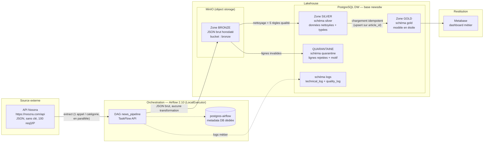
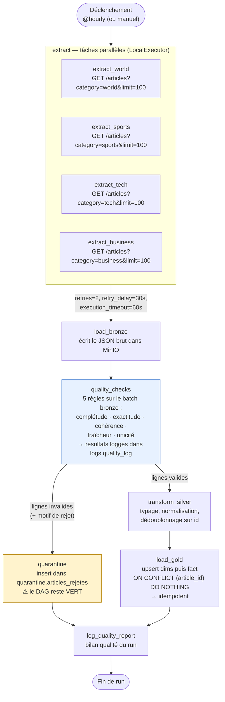
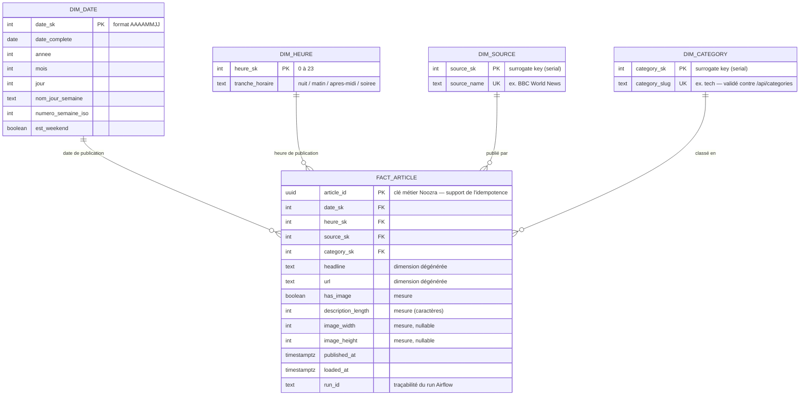

# Document de conception — Pipeline Lakehouse Noozra

> Livrable partie 3 du TP autonome. Les diagrammes sont en Mermaid et se rendent
> directement sur GitHub/GitLab.

---

## 1. Formulation écrite du problème métier

**Domaine métier.** Veille média : suivi du flux d'articles publiés par un
agrégateur d'actualités multi-sources (API publique Noozra), couvrant plusieurs
rubriques (world, sports, tech, business, entertainment, general…).

**Question métier.** *Quelles catégories et quelles sources dominent le flux
d'actualité sur les 7 derniers jours, et à quelles heures de la journée le
volume de publication est-il le plus dense ?* La réponse permet une décision
concrète : choisir l'heure d'envoi de la newsletter quotidienne et rééquilibrer
la couverture éditoriale par rubrique.

**Destinataire.** La responsable de veille éditoriale d'une rédaction. Elle
consulte le dashboard chaque matin pour (1) caler l'heure d'envoi de sa
newsletter sur les pics de publication, (2) repérer les rubriques
sur- ou sous-alimentées, (3) identifier les sources les plus productives à
surveiller en priorité.

**Lien avec le dashboard (partie 6).** Chaque visualisation se justifie par
rapport à cette question :

| Visualisation | Partie de la question couverte |
|---|---|
| Courbe du nombre d'articles par jour (7 j) | tendance du volume global |
| Barres empilées articles par catégorie / par source | qui domine le flux |
| Heatmap ou barres du volume par heure de la journée | meilleur créneau newsletter |
| KPI : total articles 7 j + % avec image | indicateur agrégé clé |

---

## 2. Schéma d'architecture data



**Choix structurants**

- **Bronze sur MinIO** : le JSON de l'API est stocké tel quel
  (`bronze/noozra/dt=YYYY-MM-DD/run=<run_id>/<categorie>.json`), ce qui rend
  tout retraitement possible sans rappeler l'API (précieux avec le quota de
  100 req/jour).
- **Silver et gold dans PostgreSQL** : données typées, contraintes SQL,
  requêtes d'idempotence simples, et branchement direct de Metabase.
- **Metadata DB Airflow séparée** (`postgres-airflow`) : exigée par l'énoncé,
  et nécessaire au LocalExecutor pour exécuter les extractions par catégorie
  en parallèle.

---

## 3. Diagramme du pipeline (DAG `news_pipeline`)



**Les trois chemins démontrables (livrable 3)**

| Chemin | Comment le déclencher | Résultat attendu dans l'UI Airflow |
|---|---|---|
| **Nominal** | run normal | DAG vert, lignes en silver + gold, `quality_log.passed = true` |
| **Échec qualité** | Variable Airflow `news_inject_bad_data = true` → injection dans le bronze d'articles corrompus (`headline` manquant, `category` inconnue, `published_at` futur) | DAG **vert**, lignes déviées en `quarantine.articles_rejetes`, `quality_log.records_failed > 0` |
| **Échec technique** | Variable Airflow `noozra_base_url = https://noozra.com/api-inexistant` | tâches extract en échec après 2 retries → DAG **rouge**, erreur dans `logs.technical_log` |

**Paramètres de robustesse** (sur toutes les tâches faisant de l'I/O réseau ou
DB) : `retries=2`, `retry_delay=timedelta(seconds=30)`,
`execution_timeout=timedelta(seconds=60)`. Le plafond de 2 retries est
volontaire : quota API de 100 requêtes/jour/IP.

**Logging à deux niveaux** : logs Airflow natifs par tâche (visibles dans
l'UI) **et** logs métier persistés en base — `logs.quality_log` (une ligne par
règle et par run) et `logs.technical_log` (erreurs applicatives, volumétries).

---

## 4. Modèle de données gold — schéma en étoile



**Grain de la table de faits** : 1 ligne = 1 article publié. La mesure
principale est le comptage (`COUNT(*)`), enrichie de mesures descriptives
(`has_image`, `description_length`).

**Idempotence du chargement gold** : clé primaire sur `article_id` (UUID fourni
par l'API) et chargement en `INSERT … ON CONFLICT (article_id) DO NOTHING`.
Rejouer le même run ne crée aucun doublon. Vérification (livrable 4) :

```sql
-- Doit retourner 0 ligne, avant comme après un re-run du DAG
SELECT article_id, COUNT(*)
FROM gold.fact_article
GROUP BY article_id
HAVING COUNT(*) > 1;

-- Volumétrie stable entre deux exécutions identiques
SELECT COUNT(*) AS nb_faits FROM gold.fact_article;
```

**Correspondance question métier ↔ modèle** : le volume par jour s'obtient via
`dim_date`, le créneau horaire via `dim_heure`, la domination par rubrique et
par source via `dim_category` et `dim_source` — chaque axe de la question a sa
dimension dédiée.

---

## 5. Règles qualité (bronze → silver)

| # | Dimension qualité | Règle appliquée | Si échec |
|---|---|---|---|
| 1 | **Complétude** | `id`, `headline`, `url`, `published_at`, `source`, `category` non nuls et non vides | quarantaine |
| 2 | **Exactitude** | `url` commence par `http(s)://` ; `published_at` parseable ISO 8601 ; `image_width/height` > 0 ou null | quarantaine |
| 3 | **Cohérence** | `category` ∈ référentiel `GET /api/categories` ; `published_at` ≤ horodatage du run | quarantaine |
| 4 | **Fraîcheur** | l'article le plus récent du batch a moins de 24 h | warning loggé (règle de batch, pas de ligne) |
| 5 | **Unicité** | `id` unique dans le batch et absent de silver (dédoublonnage) | doublon écarté et loggé |

Chaque règle est appliquée **et loggée séparément** dans `logs.quality_log`
(une ligne par règle et par run : `records_checked`, `records_failed`,
`passed`, `details` JSONB).

---

## 6. Conventions de nommage

- **MinIO** : `bronze/noozra/dt=<YYYY-MM-DD>/run=<run_id>/<categorie>.json`
- **Schémas Postgres** : `silver`, `quarantine`, `gold`, `logs` (anglais, singulier)
- **Tables gold** : préfixes `dim_` / `fact_` ; clés de substitution suffixées `_sk`
- **Tâches Airflow** : `verbe_objet` en snake_case (`extract_tech`, `load_bronze`, `quality_checks`, `transform_silver`, `load_gold`)
- **DAG** : `news_pipeline` ; `run_id` Airflow propagé jusqu'à `fact_article.run_id` pour la traçabilité de bout en bout